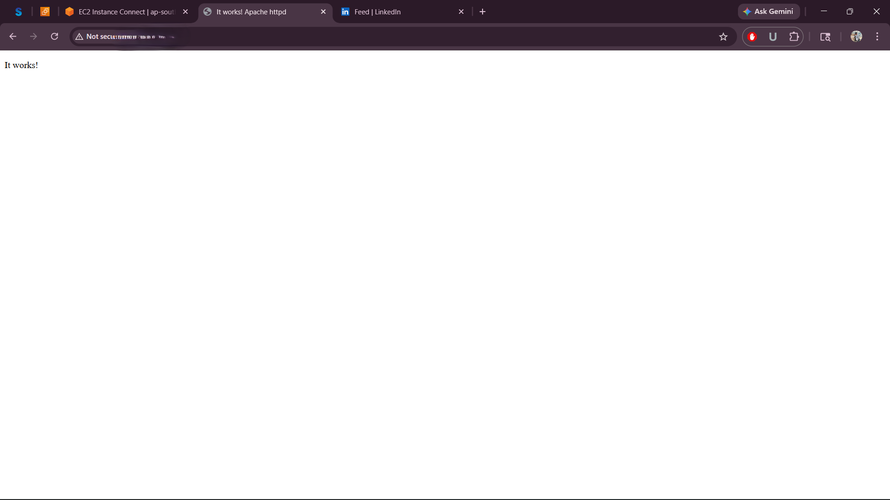
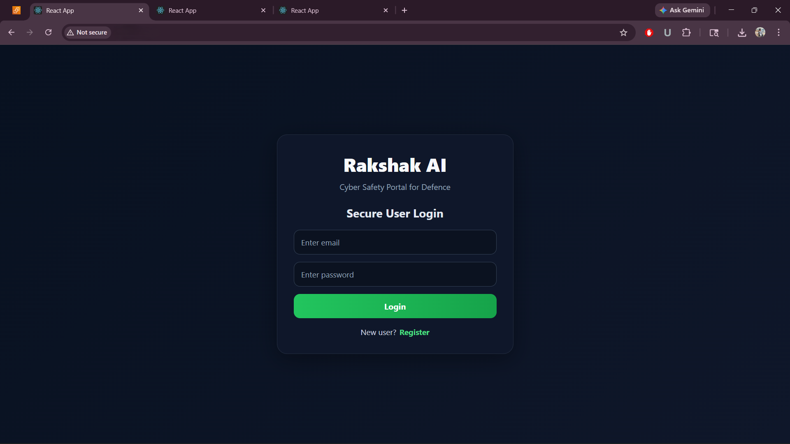

# 🌐 AWS EC2 Website Deployment

## 🚀 Overview
Deployed a live website on AWS EC2 using Linux and Apache.

This project demonstrates real-world cloud deployment, server configuration, and debugging.

---

## 🧰 Tech Stack
- AWS EC2
- Linux (Ubuntu)
- Apache Web Server
- HTML

---

## ⚙️ What I Did
- Launched EC2 instance
- Connected via SSH
- Installed Apache server
- Configured security groups (port 80)
- Deployed website files
- Fixed real-world issues (HTTP blocked, permissions)

---

## 🧠 Key Learnings
- Cloud deployment is not just coding
- Networking & security groups are critical
- Debugging is a major part of cloud engineering

---

## 📸 Screenshots

---

## 🔥 Real Problems I Faced
- SSH connection failure
- Port 80 not accessible
- Apache not starting

---

## ✅ How I Solved
- Fixed Security Group inbound rules
- Restarted Apache service
- Checked firewall & permissions

---

## 🌍 Live Demo
(Add your public IP link here if active)

---

## 🎯 Future Improvements
- Add Nginx reverse proxy
- Deploy backend (FastAPI)
- Add domain & HTTPS

---

## 👨‍💻 Author
Boomesh  
Cloud Engineering Learner (AWS)
